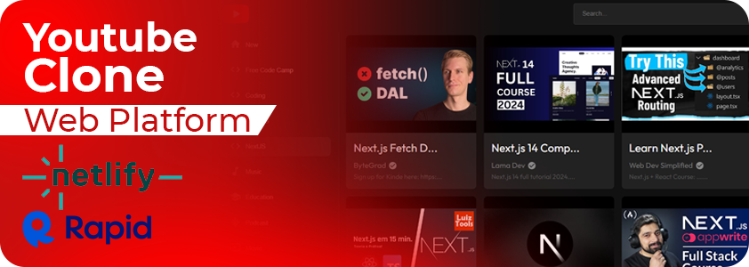
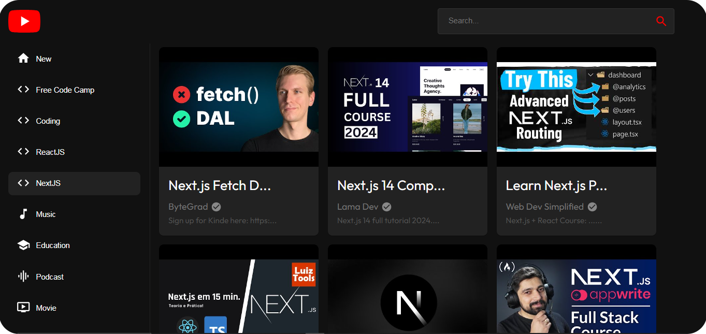
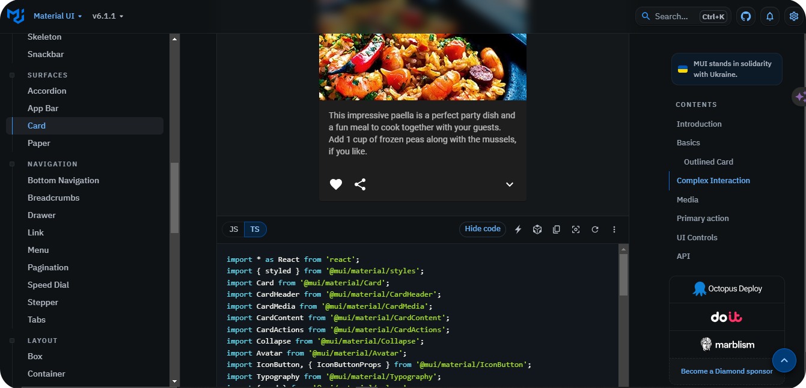
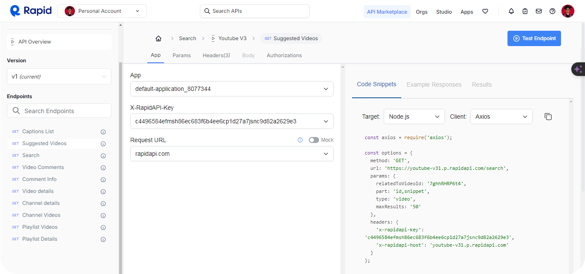
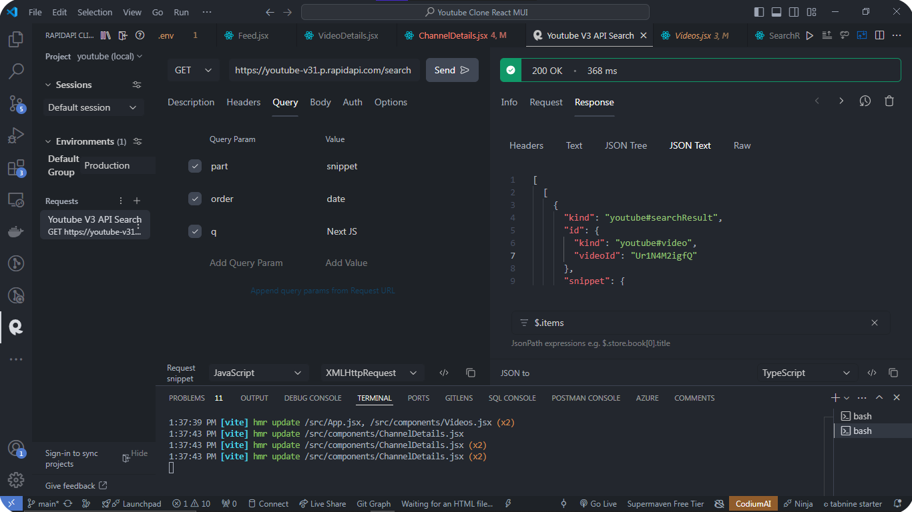
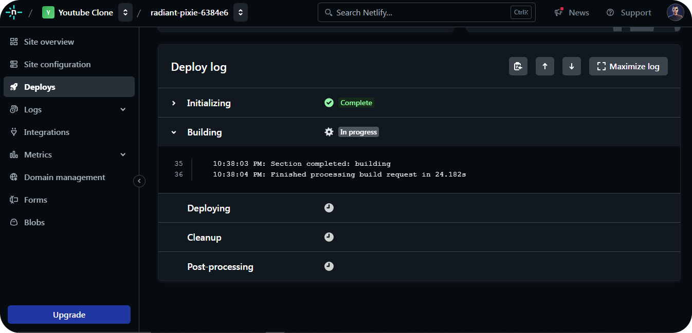
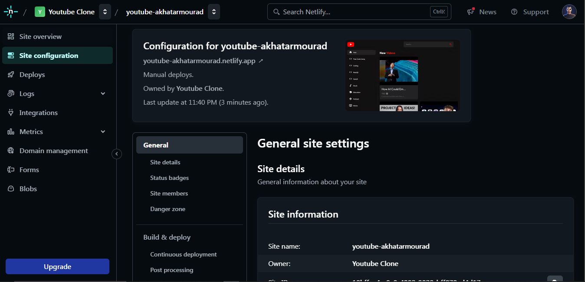

# Youtube Clone



## Overview

This is a feature-rich React web application that mimics the core functionalities of YouTube, allowing users to search for and watch videos, explore various categories, and view channels. It delivers a modern UI and is highly responsive across devices, ensuring a seamless user experience. Material UI for styling and layout, RapidAPI for video data retrieval, and is deployed on Netlify.

## Tech Stack

- **Frontend:**

- React: A JavaScript library for building user interfaces.
- Material UI: A React-based component library that provides pre-built, accessible, and customizable UI components.

- **API Integration:**

- RapidAPI: Used to fetch video data, such as trending videos, channels, and video details.

- **Deployment:**

- Netlify: A cloud platform for automating deployment of modern web projects.

## Functionalities

- **Search Videos:** Allows users to search for videos from the vast YouTube library.
- **Play Videos:** Users can click on a video to watch it in a full-featured player.
- **Explore Channels:** Users can browse through channels and view details such as recent uploads and playlists.
- **Browse Categories:** Videos are organized into categories, making it easier for users to explore content by interest.

## Demo



Integrate Mateirla UI components to develop a seamless UI



Use of RapidAPI to fetch Youtube Videos & Channels Details





Deploy the project using Netlify services






## Build the Project

I built the project using the following command

```bash
npm run build
```

This command generates a build folder containing optimized static files (HTML, CSS, and JavaScript) for production. The reason for building the project is to ensure that the application is ready for deployment with improved performance, smaller file sizes, and faster load times. The build process removes unnecessary development code, providing an efficient and optimized version of the app for end users.

## Usage

Move to the client folder the use the [npm](https://www.npmjs.com/) to install necessary packages & dependencies.

```bash
npm install
```

Run the application using the following command:

```bash
npm run dev
```

After running the application, you can access the dashboard via the link provided in the console.

## 🔗 Links

[](https://akhatarmourad.github.io/portfolio/)
[](https://www.linkedin.com/in/akhatarmourad/)